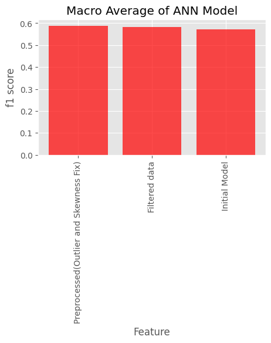
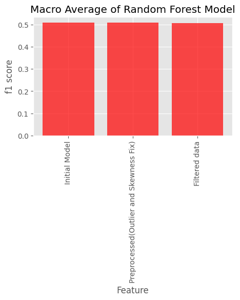

# Lending Club
### Just a simple notebook on loan default prediction with Lending Club Data using random forest and Artificial Neural Network (ANN)
## Finding
  
#### No significant improvement with data preprocessing (skewness and outlier fix) and feature selection based on ANOVA and Chi square test. However, in all case ann provides better performance with 6 to 7% improvement in macro f1 value
